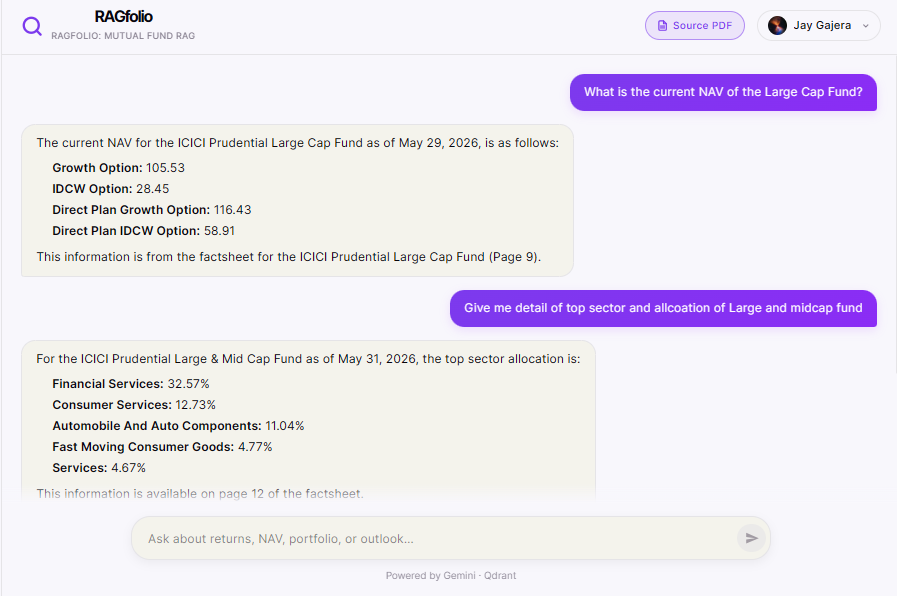
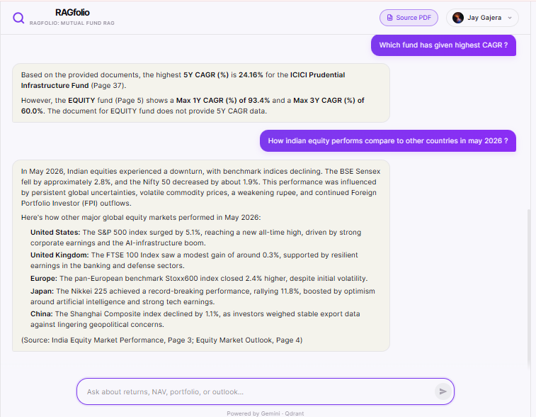

# 🌌 RAGfolio - Multimodal RAG for Mutual Fund Factsheets


**RAGfolio** is a specialized Multimodal Retrieval-Augmented Generation (RAG) pipeline designed to ingest, process, and accurately query ICICI Mutual Fund factsheets. This system goes beyond traditional text-based RAG; it visually understands complex financial document layouts, dynamically extracts charts, and retrieves both text and images to provide context-rich, highly accurate answers about your funds.

🚀 **Site is live at:** [https://ragfolio-frontend.vercel.app](https://ragfolio-frontend.vercel.app/)

🔗 **Frontend Repository:** [https://github.com/jaygajera17/RAGfolio-Frontend](https://github.com/jaygajera17/RAGfolio-Frontend)

⚙️ **Backend Repository (Technical Details):** [https://github.com/jaygajera17/RAGfolio-Backend](https://github.com/jaygajera17/RAGfolio-Backend)

📄 **Factsheet PDF:** The sample ICICI Mutual Fund factsheet used in this project can be found [here](./src/assets/icici-fund-factsheet-for-may-2026.pdf).

---

### Preview




## Tech stack
 
| Layer | Technology |
|---|---|
| Frontend | React + Vite, assistant-ui |
| Auth | Auth0 (PKCE flow) |
| Backend | FastAPI (Python) |
| Embeddings | Gemini Embedding 2.0 — 3072 dimensions |
| Vector store | Qdrant Serverless (cloud) |
| PDF extraction | PyMuPDF (fitz) |
| LLM | Gemini 1.5 Pro via `ChatGoogleGenerativeAI` |
| Deployment | Vercel (frontend) |

## 🛠️ Steps to run the Frontend

Follow these steps to set up and run the frontend locally:

1. **Clone the repository**
   ```bash
   git clone https://github.com/jaygajera17/RAGfolio-Frontend.git
   cd RAGfolio-Frontend
   ```

2. **Install dependencies**
   Make sure you have Node.js installed, then run:
   ```bash
   npm install
   ```

3. **Environment Configuration**
   Create a `.env` file in the root of your project and configure your variables (such as Auth0 credentials and the backend API URL).
   ```env
   VITE_AUTH0_DOMAIN=your-auth0-domain
   VITE_AUTH0_CLIENT_ID=your-auth0-client-id
   VITE_API_URL=http://localhost:3000
   ```

4. **Start the development server**
   ```bash
   npm run dev
   ```
   Open your browser and navigate to the local URL provided in your terminal (usually `http://localhost:5173`).

| Variable | Where to find it |
|---|---|
| `VITE_AUTH0_DOMAIN` | Auth0 dashboard → Applications → your app → Domain |
| `VITE_AUTH0_CLIENT_ID` | Auth0 dashboard → Applications → your app → Client ID |
| `VITE_API_URL` | Your locally running FastAPI backend (default: `http://localhost:3000`) |